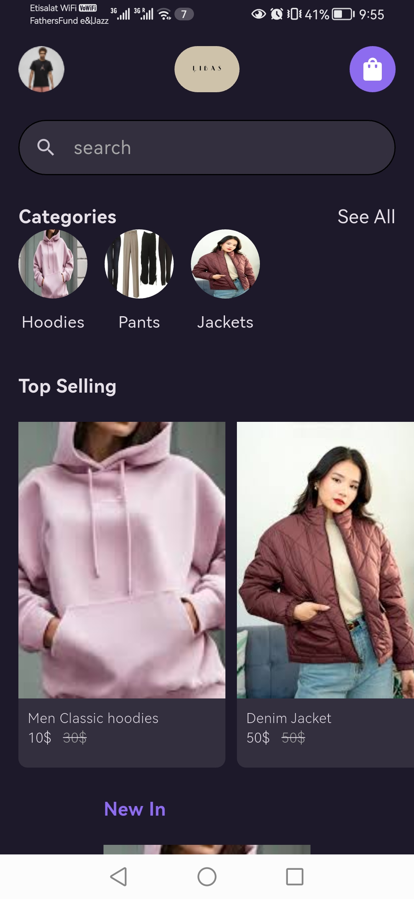

# Project Overview

This project is a Flutter application developed with Flutter version **3.27.4**. To run this project successfully, ensure that your system has Flutter SDK **3.27.4 or higher** installed.

## Getting Started

### Prerequisites
Ensure you have the following installed:
- Flutter SDK (>= 3.27.4)
- Dart
- Android Studio or VS Code with Flutter extension
- Emulator or a physical device

### Running the Project
1. Clone the repository.
2. Open the terminal in the project directory and run:
   ```sh
   flutter pub get
   ```
3. To run the application, execute:
   ```sh
   flutter run
   ```

## Code Architecture

The project follows a clean architecture approach, separating concerns into different layers. Below is an overview of the structure:

- **common/**: Contains shared utilities and state management logic.
- **core/**: Includes configurations, constants, and use cases.
- **data/**: Contains models, repositories, and sources for data handling.
- **domain/**: Defines entities and business logic.
- **presentation/**: Manages UI components, including screens, widgets, and state management.

### State Management
This project uses both **Provider** and **Bloc** to demonstrate versatility:

- **Provider:**
  - User Info Provider
  - Categories
  - Products
  - Cart

- **Bloc:**
  - Product Details
  - Settings


### Database
**Firebase** is used to store all data related to **User**,**Products**,**Orders** and **Categories**

## Demo Video
To see the application in action, refer to the demo video embedded below:

[](https://youtube.com/shorts/wERiAwKhXKE?feature=share)

## APK Download
The APK file is available in the **Tags** section of the repository.

---

Feel free to reach out if you need any clarifications or modifications!
